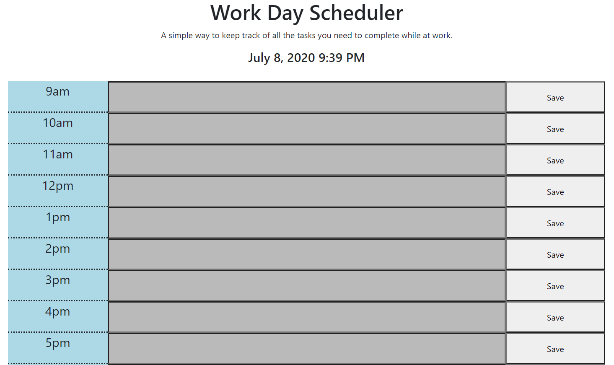

# Daily-Calendar
This daily calendar is for a work day. You can add notes in the input area and click save to save the text to the local storage which is called on refresh. It is also color coded so that grey is in the past, red is current, green is in the future. 

## How to Use
The user can add their schedule to the application and track their day. If the user leave the application, the schedule will be saved in local storage.  The color coding is only visible during the schedule times. 

## Image
